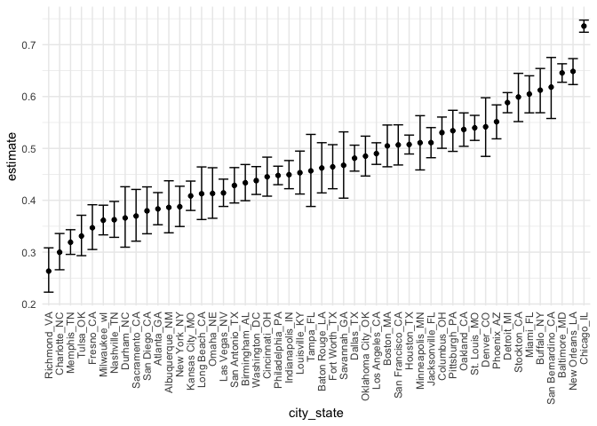
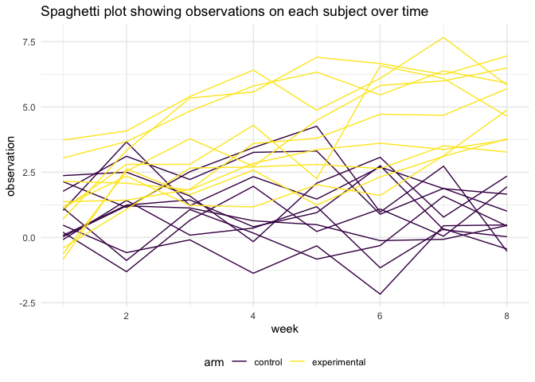
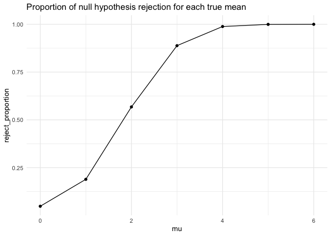
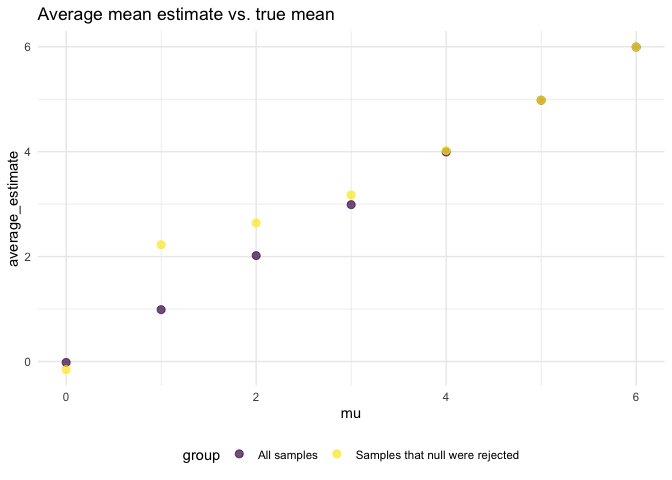
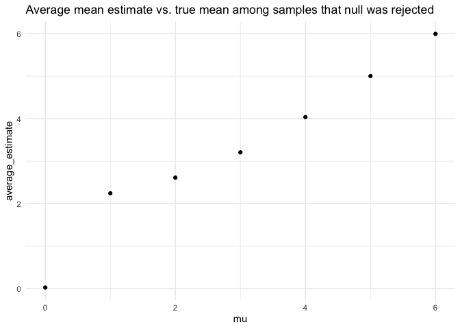

Homework 5
================
Yuanming Mao

## Problem 1

The raw data collect information on more than 52,000 criminal homicides
over the past decade in 50 of the largest American cities. The data
included the location of the killing, whether an arrest was made and, in
most cases, basic demographic information about each victim.

Read in the data.

``` r
homicide_df = 
  read.csv("homicide_data/homicide-data.csv") %>% 
  mutate(
    city_state = str_c(city, state, sep = "_"),
    resolved = case_when(
      disposition == "Closed without arrest" ~ "unsolved",
      disposition == "Open/No arrest" ~ "unsolved",
      disposition == "Closed by arrest" ~ "solved"
    )
  ) %>% 
  select(city_state, resolved) %>% 
  filter(city_state != "Tulsa_AL")
```

Let’s look at this a bit

``` r
aggregate_df = 
  homicide_df %>% 
  group_by(city_state) %>% 
  summarise(
    hom_total = n(),
    hom_unsolved = sum(resolved == "unsolved")
  )
```

    ## `summarise()` ungrouping output (override with `.groups` argument)

prop test for Baltimore

``` r
prop.test(
  aggregate_df %>%  filter(city_state == "Baltimore_MD") %>% pull(hom_unsolved),
  aggregate_df %>%  filter(city_state == "Baltimore_MD") %>% pull(hom_total)
  ) %>% 
  broom::tidy()
```

    ## # A tibble: 1 x 8
    ##   estimate statistic  p.value parameter conf.low conf.high method    alternative
    ##      <dbl>     <dbl>    <dbl>     <int>    <dbl>     <dbl> <chr>     <chr>      
    ## 1    0.646      239. 6.46e-54         1    0.628     0.663 1-sample… two.sided

prop test for all cities

``` r
results_df = 
  aggregate_df %>% 
  mutate(
    prop_tests = map2(.x = hom_unsolved, .y = hom_total, ~prop.test(x = .x, n = .y)),
    tidy_tests = map(.x = prop_tests, ~broom::tidy(.x))
  ) %>% 
  select(-prop_tests) %>% 
  unnest(tidy_tests) %>% 
  select(city_state, estimate, conf.low, conf.high)
```

A plot that shows the estimates and CIs for each city

``` r
results_df %>% 
  mutate(city_state = fct_reorder(city_state, estimate)) %>% 
  ggplot(aes(x = city_state, y = estimate)) +
  geom_point() +
  geom_errorbar(aes(ymin = conf.low, ymax = conf.high)) +
  theme(axis.text.x = element_text(angle = 90, vjust = 0.5, hjust = 1))
```

<!-- -->

## Problem 2

Import and tidy data

``` r
path_df = 
  tibble(
    path = list.files("lda_data"),
  ) %>% 
  mutate(
    path = str_c("lda_data/", path),
    output_list = map(path,read.csv)
    ) %>% 
  unnest(output_list) %>% 
  mutate(
    arm = case_when(
      str_detect(path,"con") ~ "control",
      str_detect(path,"exp") ~ "experimental"
    ),
    id = str_extract(path, "\\d\\d"),
    id = as.numeric(id)
  ) %>% 
  select(-path) %>% 
  relocate(arm, id) %>% 
  pivot_longer(
    week_1:week_8,
    names_to = "week",
    values_to = "observation"
  ) %>% 
  mutate(
    week = str_remove(week, "week_"),
    week = as.numeric(week)
    )
```

Spaghetti plot showing observations on each subject over time

``` r
path_df %>%
  mutate(id = str_c(arm, "_", id)) %>% 
  ggplot(aes(x = week, y = observation, color = arm, group = id)) + 
  geom_line() +
  labs(title = "Spaghetti plot showing observations on each subject over time")
```

<!-- -->

The baseline values of observation were about the same across groups.
The experimental arm experienced more increase in observation values
than control group. The observation values of the control group remained
about the same from week 1 to week 8.

## Problem 3

Generate the simulation dataframe with t-test results for mu = 0

``` r
sim_df = 
  tibble(
    mu = 0,
    sim_data = rerun(5000, rnorm(30, mean = mu, sd = 5))
  ) %>% 
  mutate(
    ttest_output = map(.x = sim_data, ~t.test(.x, mu = 0)),
    tidy_tests = map(.x = ttest_output, ~broom::tidy(.x))
  ) %>% 
  select(-sim_data, -ttest_output) %>% 
  unnest(tidy_tests) %>% 
  select(mu, estimate, p.value)
```

Repeat for mu = 1, 2, 3, 4, 5, 6

``` r
sim_repeat_df =
  tibble(
    mu = 1:6,
    sim_data = map(.x = mu, ~rerun(5000, rnorm(30, mean = .x, sd = 5)))
  ) %>% 
  unnest(cols = sim_data) %>% 
  mutate(
    ttest_output = map(.x = sim_data,  ~t.test(.x, mu = 0)),
    tidy_tests = map(.x = ttest_output, ~broom::tidy(.x))
  ) %>% 
  select(-sim_data, -ttest_output) %>% 
  unnest(tidy_tests) %>% 
  select(mu, estimate, p.value)

sim_df = 
  sim_df %>% 
  bind_rows(sim_repeat_df)
```

plot of null hypothesis rejection proportion against mu

``` r
sim_df %>% 
  group_by(mu) %>% 
  summarise(reject_proportion = sum(p.value < 0.05) / n()) %>% 
  ggplot(aes(x = mu, y = reject_proportion)) +
  geom_point() +
  geom_line() +
  labs(title = "Proportion of null hypothesis rejection for each true mean")
```

    ## `summarise()` ungrouping output (override with `.groups` argument)

<!-- -->

A plot showing the average estimate of mean against the true mean

``` r
sim_df %>% 
  group_by(mu) %>% 
  summarise(average_estimate = mean(estimate)) %>% 
  ggplot(aes(x = mu, y = average_estimate)) +
  geom_point() +
  labs(title = "Average mean estimate versus true mean")
```

    ## `summarise()` ungrouping output (override with `.groups` argument)

<!-- -->

A plot showing the average estimate of mean against the true mean only
in samples for which the null was rejected.

``` r
sim_df %>% 
  filter(p.value < 0.05) %>% 
  group_by(mu) %>% 
  summarise(average_estimate = mean(estimate)) %>% 
  ggplot(aes(x = mu, y = average_estimate)) +
  geom_point() +
  labs(title = "Average mean estimate vs. true mean among samples that null was rejected")
```

    ## `summarise()` ungrouping output (override with `.groups` argument)

<!-- -->

Is the sample average of μ̂ across tests for which the null is rejected
approximately equal to the true value of μ? Why or why not?
